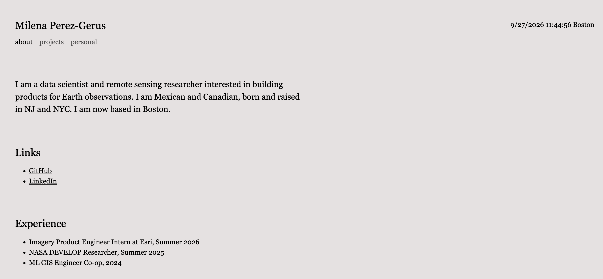

# Milena Perez-Gerus: Personal Homepage

A personal homepage for Milena Perez-Gerus, a graduate student in data science.

- **Live site:** https://mimiperezg.github.io/homepageMilenaPerezGerus/
- **Video demo:** [Watch on YouTube](https://youtu.be/jEt1bAIyMLc)
- **Design document:** [Design document (PDF)](files/Design_Document.pdf)
- **Slides:** [Presentation](https://docs.google.com/presentation/d/1QSY7nMKCLDU5cDD0nmgX8FAsuz2XTPXPa5Cv53TdilM/edit?usp=sharing)



## Project Objective

Build a personal homepage with vanilla HTML5, CSS3, and ES6+ JavaScript that introduces who I am, what I have worked on, and what I care about outside of work. The site has three pages:

- **About** (`index.html`): bio, links, experience, and education
- **Projects** (`projects.html`): research and coursework in remote sensing and machine learning (AI-generated page)
- **Personal** (`personal.html`): a photo gallery with field notes

## Creative Addition

**Photo notes.** On the personal page, clicking a photo reveals a caption over it with the date and my field notes on the setting. Clicking again hides it. Each photo is a `<button>`.

## Original JavaScript Features

All JavaScript lives in `js/main.js`.

- **Live clock:** the header shows the current date and time in Boston (24-hour format), updated every second with `setInterval`.
- **Click-to-reveal captions:** clicking a photo toggles its caption using the `hidden` attribute.

**Credits:** Design inspired by [minchi.co](https://minchi.co/). Photo gallery adapted from Bootstrap 5 ["Gallery with 4 images"](https://library.livecanvas.com/sections/gallery-with-4-images/) snippet.

## GenAI Usage

**Model:** Claude Opus 5.5 (Anthropic), via claude.ai

**AI-generated page:** `projects.html` and its CSS were generated by Claude from the prompt below, which included my project descriptions and the site's requirements. Follow-up prompts matched it to my existing pages, changed the layout to a Bootstrap grid (first two columns, then three: date, details, and an image), widened the page, and added project links and images. I then edited the intro text and removed an unneeded media query.

<details>
<summary>Projects page prompt</summary>

> Create a `projects.html` page for my personal homepage. It should match the existing site exactly: same `<head>` (meta tags, Bootstrap 5 CDN, `css/style.css`, `<script type="module" src="js/main.js">`), same header and nav, same wrapper and classes.
>
> Requirements: minimalist style; semantic HTML with proper heading order; classes to identify elements; `aria-current="page"` on the projects link; no W3C validator errors; descriptive alt text on images; new CSS given separately, with no `!important` and no inline styles; each project links to its GitHub repo or publication. Incorporate a Bootstrap grid system, where there are three columns: the dates in the left column, the content in the middle column, and a third column for visuals.
>
> My projects: [descriptions of my NASA DEVELOP, rotation-equivariant, air pollution capstone, and cloud detection projects]

</details>

**Other uses:**

- **Learning:** explanations of design documents, Bootstrap classes (e.g. `visually-hidden`, removing container margins), `data-*` attributes for the photo captions, and what Prettier and ESLint do and how to utilize them.
- **Setup:** configuring `.gitignore` and confirming ESLint and Prettier were installed correctly.
- **Writing:** Claude helped draft this README and break down what a user persona is to aid me to starting my writing.

## Tech Requirements

- HTML5, CSS3, and vanilla JavaScript (ES6 modules)
- [Bootstrap 5.3](https://getbootstrap.com/) via CDN (grid, flexbox, and utility classes)
- [Node.js](https://nodejs.org/) and npm (only for development tools)
- ESLint (class config) and Prettier

## How to Install and Use

1. Clone the repository:

```bash
   git clone https://github.com/mimiperezg/homepageMilenaPerezGerus.git
   cd homepageMilenaPerezGerus
```

2. Install the development tools:

```bash
   npm install
```

3. Open `index.html` with a local server, such as the VS Code **Live Server** extension. A server is required because the JavaScript is loaded as an ES6 module.
4. Format and lint the code:

```bash
   npm run format
   npm run lint
```

## Author

**Milena Perez-Gerus**: [Homepage](https://mimiperezg.github.io/homepageMilenaPerezGerus/) · [GitHub](https://github.com/mimiperezg)

## Class

Created for [CS 5610 Web Development](https://johnguerra.co/classes/webDevelopment_online_fall_2026/) at Northeastern University, taught by John Alexis Guerra Gómez.
